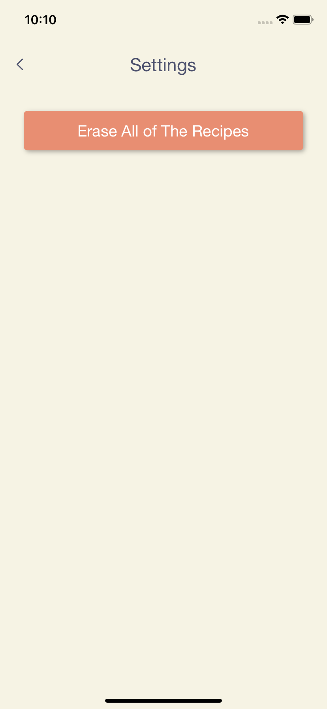

# SoapCalculator

An iOS app that I built to calculate the amount of KOH and NaOh to make soap. You can also save the calculated amounts as soap recipes. This app is using realm database 
to save the initial saponification values for each oil as well as the soap recipes. 

### Main View:

### Add Recipe 

### Save Recipe

### Search

### Settings 

